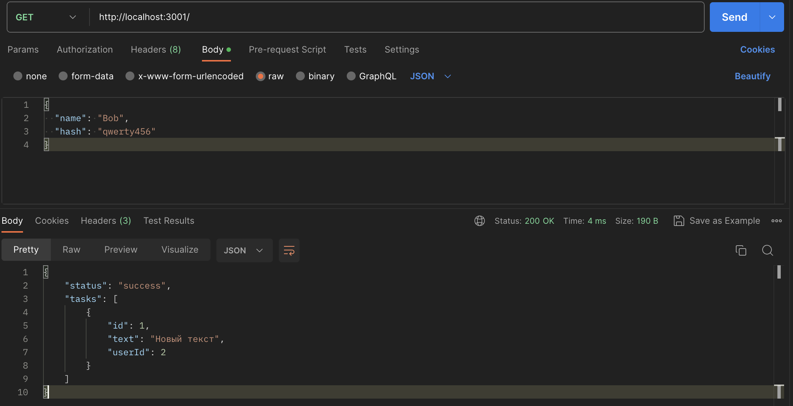
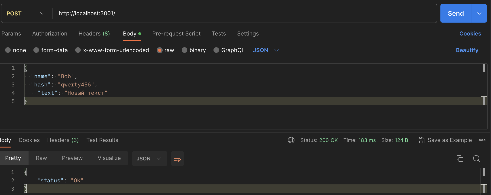
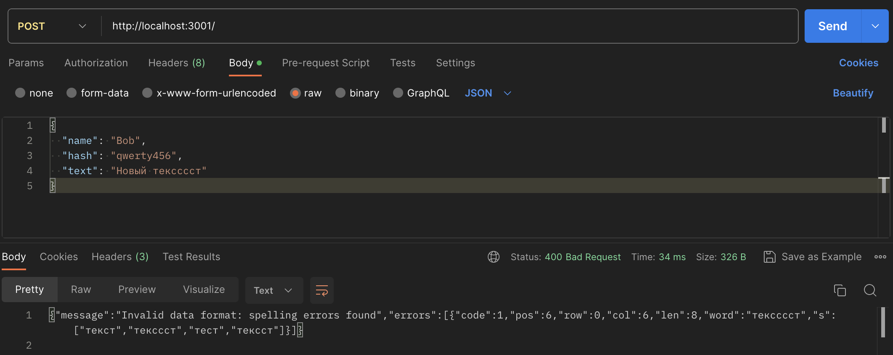
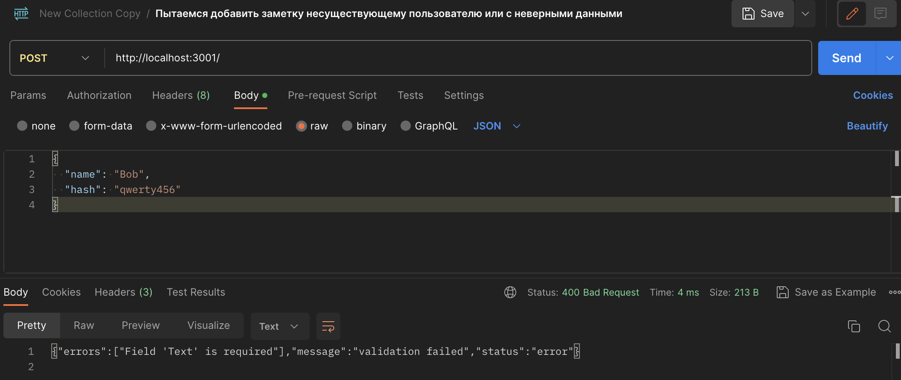
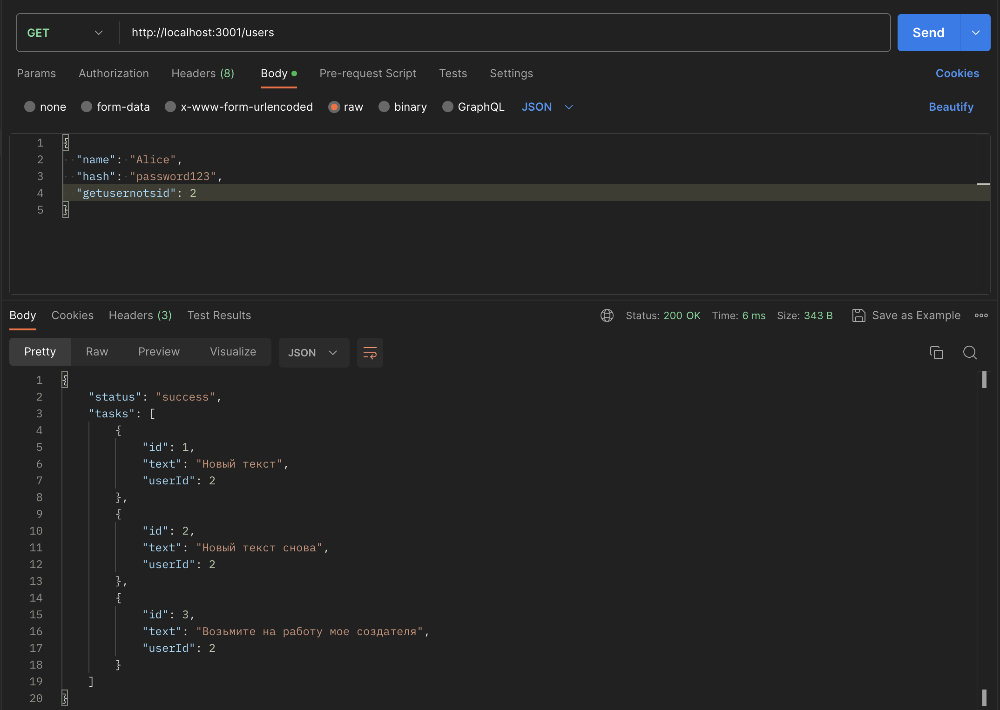

  README для NoteVaultAPI

Note API
=============

Это простое API для создания заметок.

Функции API
-----------

API предоставляет следующие функции:

*   Создание задачи с полями:
    *   Добавление заметок
    *   Вывод списка заметок

*   Логирование (Используется библиотка "log/slog")
*   Аутентификация (разделение пользователей на роли. Пользователи админы могут просматриваь чужие заметки по id пользователя)
*   Авторизация (hardcode)
*   Заданные пользователи:
``` 
    1: {name: "Alice", role: "admin", hash: "password123"},
	2: {name: "Bob", role: "user", hash: "qwerty456"},
	3: {name: "Charlie", role: "user", hash: "letmein789"},
	4: {name: "Dave", role: "admin", hash: "adminpass"},
	5: {name: "Eve", role: "user", hash: "evepass321"}, 
```

Предварительные требования для запуска:
--------------------------

*   Docker
*   Docker Compose

Начало работы
-------------

Следуйте этим инструкциям, чтобы запустить приложение:

### 1\. Клонируйте репозиторий

    git clone git@github.com:FattakhovRamil/NoteVaultAPI.git
    cd NoteVaultAPI

### 2\. Постройте и запустите приложение с помощью Docker Compose
    docker pull postgres:latest
    docker pull golang:1.21-alpine
    docker-compose up --build

### 3\. Доступ к приложению находиться по адресу:

*   [http://localhost:3001/](http://localhost:3001/)

API Эндпоинты
-------------

Вот некоторые примеры API используя Postman:

### GET / - Получить список задач пользователя.

 http://localhost:3001/
```
{
  "name": "Bob", // Имя пользователя
  "hash": "qwerty456" // Пароль пользователя
}
```



### POST / - Создать новую заметку.
 В теле передаем данные пользователя и желаемый текст
```
  {
    "name": "Bob",
    "hash": "qwerty456",
    "text": "Новый текст" // до 255 символов
  }
```



#### При некорректном тексте возвращается ошибка:


#### При отсутствии тексте возвращается ошибка:



### GET /users - Пользователи с ролью админа могу получить чужие заметки по id пользователя
  ```
    {
      "name": "Alice",
      "hash": "password123",
      "getusernotsid": 2
    }
  ```

  

Проверка сервиса
-------------

Для проверки сервиса можно воспользоваться Postman коллекциями в папке tests

База данных
-----------

Приложение использует PostgreSQL для хранения заметок.

